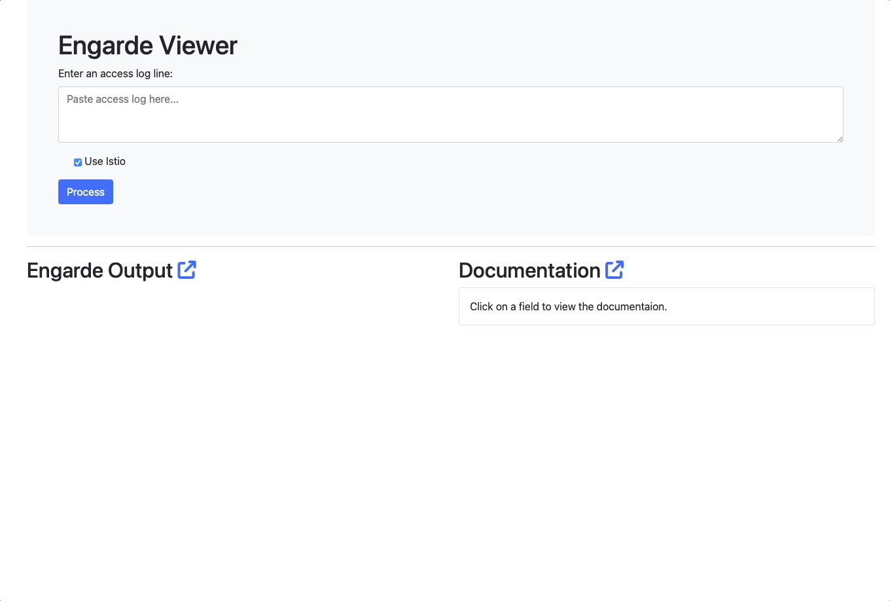

# Connect the dots between Engarde and Envoy Access Logs 
Get a more verbose description of your [Envoy access logs](https://www.envoyproxy.io/docs/envoy/latest/configuration/observability/access_log/usage#command-operators) with this extension for [Engarde](https://github.com/nitishm/engarde).

# Adding a UI
I use access logs a lot in my service mesh debugging.  The default format may be parseable for more experienced Envoy users, but not for users who find themselves creating a mesh for the first time.  [Engarde](https://github.com/nitishm/engarde) introduced a convenient CLI for parsing default access log entries for Envoy and [Istio](istio.io)(powered by Envoy).  Engarde outputs a log entry as a pretty-printed JSON object with labeled field names but I wanted to take it one step further.  My UI takes a user provided access log entry, provides the output from Engarde, but also provides their corresponding documentation pulled directly from [Envoy's own documentation](https://www.envoyproxy.io/docs/envoy/latest/configuration/observability/access_log/usage#command-operators).


# Installation
 ```console
 git clone https://github.com/GregHanson/engarde-viewer.git
 cd engarde-viewer/
 go run main.go 
 starting server on port 9090 . . . 
```
